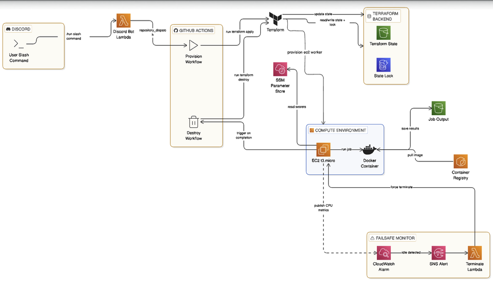

# JobFlow | On-Demand Batch Job Platform on AWS

A cloud-native, event-driven batch compute platform built on AWS. A Discord slash command triggers an ephemeral EC2 worker via GitHub Actions and Terraform, runs a containerised job, stores output to S3, and self-destructs, leaving zero idle infrastructure and zero cost between runs.

---

## Architecture


## How It Works

1. User runs `/run job=image-resize` in Discord
2. Discord bot (AWS Lambda) receives the slash command via a Lambda Function URL
3. Lambda triggers a GitHub Actions `repository_dispatch` event via the GitHub API
4. GitHub Actions runs Terraform to provision the full job infrastructure — EC2 t3.micro, 
   security group, IAM roles, CloudWatch alarm, SNS topic, and failsafe Lambda
5. `cloud-init` bootstraps the EC2 instance, installs Docker, authenticates with ECR 
   using the instance IAM role, and pulls the correct job image
6. The Docker container runs the job, it reads input from S3, processes it, writes output back to S3
7. On completion, the `cloud-init` script triggers the GitHub Actions destroy workflow 
   via a curl request to the GitHub API
8. GitHub Actions runs `terraform destroy`, tears down all provisioned resources, 
   leaving zero idle infrastructure
9. Failsafe: if the EC2 instance ever gets stuck, a CloudWatch alarm detects CPU < 5% 
   for 10 minutes → triggers SNS → Lambda terminates the instance directly via EC2 API

---

## AWS Services

| Service | Purpose |
|---|---|
| Lambda | Discord bot + CloudWatch failsafe handler |
| EC2 | Ephemeral compute for each job |
| ECR | Docker image registry for job containers |
| S3 | Job input/output storage + Terraform remote state |
| CloudWatch | CPU alarm for idle instance detection |
| SNS | Notification hub between CloudWatch and failsafe Lambda |
| IAM | Least-privilege roles for EC2, Lambda, GitHub Actions (OIDC) |
| SSM Parameter Store | Secure secrets storage — no hardcoded credentials |
| DynamoDB | Terraform state locking |

---

## Jobs

| Job | Description |
|---|---|
| `image-resize` | Fetches images from S3 input folder, compresses them, saves to S3 output folder |
| `pdf-report` | Fetches forex OHLCV data, runs technical analysis, generates a PDF report |
| `data-scrape` | Scrapes external data, processes and saves structured JSON to S3 |

Adding a new job type requires only a new Docker image pushed to ECR. The platform infrastructure is job-agnostic.

---

## Tech Stack

- **Terraform** — provisions all AWS infrastructure
- **GitHub Actions** — CI/CD pipeline, triggered via `repository_dispatch`
- **Docker** — each job packaged as an independent image
- **cloud-init** — bootstraps EC2, pulls correct ECR image, runs job
- **Python** — Discord bot, failsafe Lambda, job scripts
- **ecdsa** — Ed25519 signature verification for Discord interactions

---

## Setup

### Prerequisites
- AWS account with billing alerts configured
- GitHub repository with Actions enabled
- Discord application and bot token
- Terraform installed locally
- Docker installed locally

1. Clone the repo
bashgit clone https://github.com/quandaleIV/batch-job-runner
cd batch-job-runner
2. Create S3 bucket and DynamoDB table for Terraform remote state
Terraform needs somewhere to store state remotely so GitHub Actions can access it.
bashaws s3 mb s3://batch-job-runner-tfstate --region ap-southeast-2

aws dynamodb create-table \
  --table-name batch-job-runner-tflock \
  --attribute-definitions AttributeName=LockID,AttributeType=S \
  --key-schema AttributeName=LockID,KeyType=HASH \
  --billing-mode PAY_PER_REQUEST \
  --region ap-southeast-2
3. Create the S3 bucket for job data
This bucket holds input files the jobs read from and output files the jobs write to.
bashaws s3 mb s3://batch-job-runner-data --region ap-southeast-2
Upload a test image to the input folder so the image-resize job has something to process:
bashaws s3 cp your-image.jpg s3://batch-job-runner-data/input/test.jpg
4. Store secrets in SSM Parameter Store
All secrets are stored in AWS SSM — nothing sensitive is hardcoded anywhere in the codebase. The EC2 instance fetches these at runtime via the AWS CLI before running each job.
bashaws ssm put-parameter --name /batch-job-runner/discord-public-key --value "YOUR_VALUE" --type SecureString --region ap-southeast-2
aws ssm put-parameter --name /batch-job-runner/discord-token --value "YOUR_VALUE" --type SecureString --region ap-southeast-2
aws ssm put-parameter --name /batch-job-runner/discord-application-id --value "YOUR_VALUE" --type SecureString --region ap-southeast-2
aws ssm put-parameter --name /batch-job-runner/github-token --value "YOUR_VALUE" --type SecureString --region ap-southeast-2
aws ssm put-parameter --name /batch-job-runner/github-repo --value "YOUR_VALUE" --type SecureString --region ap-southeast-2
aws ssm put-parameter --name /batch-job-runner/twelve-data-api-key --value "YOUR_VALUE" --type SecureString --region ap-southeast-2
5. Set up GitHub Actions OIDC
GitHub Actions needs permission to provision and destroy AWS infrastructure without storing long-lived credentials. We use OIDC so GitHub Actions assumes an IAM role directly.
Create an IAM OIDC identity provider for GitHub in your AWS account, then create an IAM role with the following trust policy:
json{
  "Version": "2012-10-17",
  "Statement": [
    {
      "Effect": "Allow",
      "Principal": {
        "Federated": "arn:aws:iam::YOUR_ACCOUNT_ID:oidc-provider/token.actions.githubusercontent.com"
      },
      "Action": "sts:AssumeRoleWithWebIdentity",
      "Condition": {
        "StringLike": {
          "token.actions.githubusercontent.com:sub": "repo:YOUR_GITHUB_USERNAME/batch-job-runner:*"
        }
      }
    }
  ]
}
Attach AdministratorAccess to the role (or a scoped policy covering EC2, S3, Lambda, IAM, CloudWatch, SNS, ECR, SSM).
Add the role ARN as a secret in your GitHub repo:

AWS_ROLE_ARN — ARN of the IAM role

6. Create ECR repositories and build Docker images for each job
Each job is a separate Docker image stored in ECR. The platform is job-agnostic — cloud-init.sh pulls the correct image based on the job name passed in at runtime.
Create an ECR repository for each job:
bashaws ecr create-repository --repository-name batch-job/image-resize --region ap-southeast-2
aws ecr create-repository --repository-name batch-job/pdf-report --region ap-southeast-2
aws ecr create-repository --repository-name batch-job/data-scrape --region ap-southeast-2
Log in to ECR:
bashaws ecr get-login-password --region ap-southeast-2 | docker login --username AWS --password-stdin YOUR_ACCOUNT_ID.dkr.ecr.ap-southeast-2.amazonaws.com
Build and push each image. For example, for image-resize:
bashcd jobs/image-resize
docker build -t batch-job/image-resize .
docker tag batch-job/image-resize:latest YOUR_ACCOUNT_ID.dkr.ecr.ap-southeast-2.amazonaws.com/batch-job/image-resize:latest
docker push YOUR_ACCOUNT_ID.dkr.ecr.ap-southeast-2.amazonaws.com/batch-job/image-resize:latest
Repeat for pdf-report and data-scrape. Each Dockerfile in jobs/ contains the job logic. The platform does not care what is inside the image — it just pulls and runs it.
7. Initialise Terraform
bashcd terraform
terraform init
This connects to the S3 remote state backend and downloads the AWS provider.
8. Package and deploy the Discord bot Lambda
The bot is a Python Lambda function that verifies Discord's Ed25519 signature using the ecdsa library and triggers GitHub Actions via repository_dispatch. It must be built inside the Lambda runtime environment using Docker to avoid native binary incompatibility — libraries with compiled C extensions built on macOS will not work on Amazon Linux.
bashcd bot
docker run --rm -v $(pwd):/var/task --entrypoint pip public.ecr.aws/lambda/python:3.11 \
  install requests ecdsa -t /var/task/package/ --no-cache-dir
cp handler.py package/
cd package && zip -r ../lambda.zip . && cd ../..
Create the Lambda function:
bashaws lambda create-function \
  --function-name batch-job-discord-bot \
  --runtime python3.11 \
  --role arn:aws:iam::YOUR_ACCOUNT_ID:role/batch-job-lambda-role \
  --handler handler.lambda_handler \
  --zip-file fileb://bot/lambda.zip \
  --timeout 30 \
  --region ap-southeast-2
Create a public Function URL so Discord can reach it without AWS auth:
bashaws lambda create-function-url-config \
  --function-name batch-job-discord-bot \
  --auth-type NONE \
  --region ap-southeast-2
Add both permissions required for a public Function URL. Both are necessary — lambda:InvokeFunctionUrl alone results in a 403 Forbidden:
bashaws lambda add-permission \
  --function-name batch-job-discord-bot \
  --statement-id FunctionURLAllowPublicAccess \
  --action lambda:InvokeFunctionUrl \
  --principal "*" \
  --function-url-auth-type NONE \
  --region ap-southeast-2

aws lambda add-permission \
  --function-name batch-job-discord-bot \
  --statement-id FunctionURLInvokeAllowPublicAccess \
  --action lambda:InvokeFunction \
  --principal "*" \
  --region ap-southeast-2
9. Package the failsafe Lambda
The failsafe Lambda is provisioned by Terraform automatically, but the zip file must exist before running the workflow.
bashcd failsafe
zip failsafe.zip failsafe.py
cd ..
10. Register the Discord slash command
This is a one-time setup step that tells Discord your bot has a /run command with job choices. Without this step the command will not appear in Discord.
bashcd bot
pip3 install requests boto3
python3 register_commands.py
You should see a 201 response confirming the command was registered.
11. Set the Lambda Function URL as the Discord Interactions Endpoint URL
In the Discord Developer Portal, go to your app, click General Information, and paste your Lambda Function URL into the Interactions Endpoint URL field. Click Save Changes — Discord will send a signed PING to verify the endpoint responds correctly.
12. Run a job
In your Discord server:
/run job=image-resize
The full pipeline runs automatically: Discord sends the command to Lambda, Lambda triggers GitHub Actions via repository_dispatch, GitHub Actions runs terraform apply to provision an EC2 instance, cloud-init.sh fetches secrets from SSM, pulls the correct Docker image from ECR, runs the job, saves output to S3, then triggers the destroy workflow to tear down all infrastructure. The CloudWatch failsafe monitors CPU and terminates the instance automatically if it ever gets stuck running idle.

Cost
Each job run on a t3.micro instance costs approximately $0.001–$0.003 depending on job duration. All infrastructure is destroyed after each run — there are no idle costs between jobs.

Resume Bullets
- Built JobFlow, an on-demand batch compute platform on AWS — Discord slash command triggers 
  GitHub Actions via Lambda and API Gateway, Terraform provisions ephemeral EC2, cloud-init 
  pulls job-specific Docker image from ECR, output stored to S3, infrastructure self-destructs 
  on completion via automated Terraform destroy

- Designed job-agnostic architecture supporting multiple workload types via a containerised 
  job registry in ECR — adding a new job requires only a new Docker image, no infrastructure changes

- Implemented cost-optimisation failsafe using CloudWatch, SNS, and Lambda — automatically 
  terminates idle EC2 workers tagged as ephemeral after 10 minutes of CPU utilisation below 5%

- Configured OIDC trust between GitHub Actions and AWS — eliminated long-lived credentials 
  from the CI/CD pipeline entirely

- Secured all secrets in AWS SSM Parameter Store — no hardcoded credentials anywhere in 
  the codebase or CI/CD pipeline

---

## Resume Bullets

```
• Built JobFlow, an on-demand batch compute platform on AWS — Discord slash command triggers 
  GitHub Actions via Lambda and API Gateway, Terraform provisions ephemeral EC2, cloud-init 
  pulls job-specific Docker image from ECR, output stored to S3, infrastructure self-destructs 
  on completion via automated Terraform destroy

• Designed job-agnostic architecture supporting multiple workload types via a containerised 
  job registry in ECR — adding a new job requires only a new Docker image, no infrastructure changes

• Implemented cost-optimisation failsafe using CloudWatch, SNS, and Lambda — automatically 
  terminates idle EC2 workers tagged as ephemeral after 10 minutes of CPU utilisation below 5%

• Configured OIDC trust between GitHub Actions and AWS — eliminated long-lived credentials 
  from the CI/CD pipeline entirely

• Secured all secrets in AWS SSM Parameter Store — no hardcoded credentials anywhere in 
  the codebase or CI/CD pipeline
```

---

## Repo Structure

```
batch-job-runner/
├── terraform/
│   ├── main.tf
│   ├── variables.tf
│   └── outputs.tf
├── .github/workflows/
│   ├── provision.yml
│   └── destroy.yml
├── jobs/
│   ├── image-resize/
│   ├── pdf-report/
│   └── data-scrape/
├── bot/
│   ├── handler.py
│   ├── register_commands.py
│   └── requirements.txt
├── failsafe/
│   ├── failsafe.py
│   └── failsafe.zip
├── scripts/
│   └── cloud-init.sh
└── README.md
```